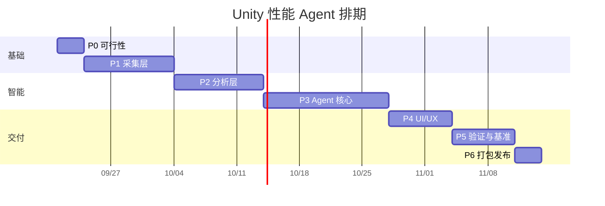

# Unity 内置性能排查 AI Agent —— 实施计划表

> 状态标记：✅ 已实现　🟡 部分实现　⬜ 待做

## 一、目标与设计原则

**目标**：在 Unity Editor 内提供可停靠的 Agent 面板，输入「我的游戏掉帧 / 卡顿 / 内存涨」，
它能自己抓 Profiler 数据、跑审计、定位根因、给出可执行修复方案。

| 原则 | 做法 | 反面案例 |
|---|---|---|
| **工具优先于模型** | 所有数值来自工具调用返回值，LLM 只负责编排与解释 | 让 LLM "估算" 帧耗时 → 必然幻觉 |
| **结论必须带证据链** | 每条诊断 = `{结论, 置信度, 证据[], 建议, 定位}` | "你的 Draw Call 太多了"（无数据、无阈值、无对比） |
| **无 LLM 也能用** | 规则引擎独立于 Agent，断网/无 Key 时退化为确定性分析报告 | Agent 成了 LLM 的壳，Key 挂了工具就废了 |

---

## 二、阶段计划

| 阶段 | 内容 | 工期 | 交付物 | 验收标准 | 状态 |
|---|---|---|---|---|---|
| **P0 可行性** | 锁定 Unity 版本；API 探针逐个验证 Profiler/内存/渲染 API；LLM 后端选型；UPM 包骨架 + asmdef 隔离 | 3 天 | API 可用性矩阵、EditorWindow 空壳 | 探针在目标版本全绿 | ✅ |
| **P1 采集层** | Profiler 抓帧与 `.raw` 加载；`ProfilerRecorder` 常驻；FrameTiming；渲染统计；内存/Temp Allocator；资源/场景/物理/脚本审计 | 1.5 周 | `PerfSnapshot` 模型 + 9 个采集器 | 一键抓 N 帧并序列化成 JSON | ✅ |
| **P2 分析层** | 规则库（阈值分级）；帧尖峰归因；性能预算资产 | 1.5 周 | 规则引擎 + 报告生成器 | 已知问题工程上命中率 ≥ 70% | ✅（5 类 gold standard 已建立） |
| **P3 Agent 核心** | LLM 接入（流式）；工具 schema 与调用循环；上下文压缩；幻觉校验；会话持久化 | 2 周 | 可对话的诊断 Agent | 结论一致率 ≥ 80%，无编造数值 | ✅（含会话持久化） |
| **P4 UI/UX** | 概览、Top 排行、问题卡片（可跳转）、一键修复、报告导出、会话对比 | 1 周 | 完整面板 + 导出 | 3 次交互内看到根因 | ✅（含快照对比页、一键修复计划） |
| **P5 验证与基准** | 5 类故障工程回归（GC Alloc 爆炸 / Draw Call 过多 / 纹理内存泄漏 / Temp Allocator 增长 / 物理配置错误）；建 gold standard | 1 周 | 评测报告 + 测试工程集 | 5 类全部定位到正确模块 | ✅（独立回归 11/11；Unity EditMode 测试已写好但默认不启用） |
| **P6 打包发布** | UPM 包、CI、README、示例工程 | 3 天 | `.tgz` 包 + 文档 | 空工程导入即用 | 🟡（UPM、CI、README、示例已完成；`.tgz` 待发布） |

**总工期**：约 8 周（1 人全职）。只做「无 LLM 的确定性分析器」可压缩到 4 周。

**里程碑**
- **M1（第 2 周末）**：能抓帧、能出离线报告 → 此时已是有用的工具
- **M2（第 4 周末）**：规则引擎定版，命中率达标
- **M3（第 6 周末）**：Agent 可对话、结论可追溯
- **M4（第 8 周末）**：可发布

---

## 三、Agent 工具清单（18 个，已实现）

| 工具 | 作用 | 限流 |
|---|---|---|
| `list_snapshots` / `load_snapshot` | 列出 / 加载历史快照 | 40 条 |
| `get_summary` | 环境 + 关键指标 + 结论概览 | 全量 |
| `get_metrics` | 全部标量指标（含预算对比） | 可过滤 |
| `get_frames` | 最慢的帧、尖峰帧号、与均值差异 | Top 8 |
| `get_markers` | Profiler Top Marker（自身耗时 / GC / 调用次数） | Top 15 |
| `get_findings` | 规则引擎结论（含完整证据链） | 可过滤 severity |
| `get_asset_issues` | 资源导入问题 | Top 20 |
| `get_scene_issues` | 场景/物理反模式 | Top 20 |
| `get_code_issues` | 脚本反模式（含隐私过滤） | Top 25 |
| `rerun_audit` | 改完资源/代码后重跑单项审计 | — |
| `run_rules` | 改预算后重新评估 | — |
| `diff_snapshots` | 两快照对比：按指标方向给出 regressed / improved 与整体 verdict | — |
| `get_budget` / `set_budget` | 读写性能预算 | — |
| `get_fix_plan` | 只读：获取带风险分级的修复计划（执行入口只在面板上） | — |
| `perf_*`（11 个，MCP） | 可选集成：把采集、自动 Play 模式测试与只读结论暴露给外部 MCP 客户端（默认关闭） | — |
| 一键修复（自动） | 资源导入 / 场景对象 / 工程设置 / 图集生成 / 两种代码改写；**执行入口只在 Unity 面板**，MCP 只返回计划 | — |
| `export_report` | 导出 MD / HTML | — |
| `probe_api` | 探测当前 Unity 版本 API 能力 | — |

---

## 四、技术选型（实际落地）

| 项 | 选择 | 理由 |
|---|---|---|
| Unity 版本 | 2021.3 LTS 起 | `ProfilerRecorder`(2020.1+)、`Physics.simulationMode`(2020.2+)、`UnityWebRequest.Result`(2020.2+) |
| UI | UI Toolkit | 数据密集列表渲染好；ImageGUI 只用于 SettingsProvider（框架要求） |
| JSON | 自写 `MiniJson` + `JsonUtility` | 零依赖。`JsonUtility` 不支持 Dictionary，故模型全部用 List + 可序列化类 |
| 异步 | `UnityWebRequest` + `DownloadHandlerScript` + `EditorApplication.update` 轮询 | 不依赖 UniTask / EditorCoroutines；SSE 流式可用 |
| 易变 API | 全部走 `Reflect` 反射适配 | 保证跨版本编译通过，拿不到就降级提示 |
| 配置 | `ScriptableSingleton` + `[FilePath]`（ProjectSettings 下） | 不进 Assets，避免导入与误提交 |
| API Key | 界面（EditorPrefs）优先，环境变量回退 | 不进版本库；界面优先避免「填了却被环境变量静默覆盖」 |
| 数据落盘 | `ProjectSettings/PerfAgent/` | 不污染 Assets、不进包体 |

---

## 五、性能预算表（诊断锚点）

绝对数值没有意义，**必须相对目标平台与预算判断**。已做成可编辑资产（`Project Settings > PerfAgent`）。

| 指标 | 移动端 60fps | PC 端 60fps | 触发等级 |
|---|---|---|---|
| 主线程帧耗时 | ≤ 12 ms | ≤ 10 ms | 超 80% 预算 Warn，超 100% Error |
| GC Alloc / 帧 | 0 B | ≤ 2 KB | 稳态非 0 → Warn；超预算 → Error |
| Draw Call | ≤ 150 | ≤ 800 | 视场景分级 |
| SetPass Call | ≤ 60 | ≤ 200 | 与材质数交叉验证 |
| Temp Allocator | 稳定，无单调增长 | 同 | 单调增长即疑似原生泄漏 |
| 纹理内存 | 按机型分档 | — | 超档位逐个列出违规资源 |

---

## 六、风险与对策

| 风险 | 影响 | 对策 | 落地情况 |
|---|---|---|---|
| Profiler API 跨版本不一致 / internal | 编译失败或读数错误 | API 探针 + 反射适配层，核心逻辑不依赖未文档化 API | ✅ |
| Profiler 内部数据第三方拿不到 | 用户误以为数据能与 Profiler 窗口等价 | 明确分级：确定性静态审计（不依赖 Profiler）/ 公开 API 实测 / internal 实验性；拿不到就不写指标并写明原因；托管分配双口径交叉校验 | ✅ |
| 抓帧本身有开销 | 测量结果失真 | 抓帧自动开关 Profiler 并复原；报告中标注 | ✅ |
| LLM 编造数值 | 工具不可信 | 工具优先 + 证据链 + 幻觉校验器（三道闸门） | ✅ |
| Token 成本 / 上下文爆炸 | 费用失控、超时 | 原始帧数据永不进 prompt；工具结果 12000 字符截断；`maxSteps` 上限 | ✅ |
| Agent 无限调用工具 | 卡死与费用失控 | `maxSteps` 到顶后强制去掉 tools 收尾 | ✅ |
| Editor 域重载丢状态 | 会话断掉 | 快照与对话均落盘；`PerfSession` 轻量不序列化 | ✅ |
| Editor 与真机差异大 | 定位错方向 | 支持 Dev Build + Autoconnect；`ProfilerRecorder` 可进 Player | 🟡（界面已提示） |
| 大工程扫描慢 | 编辑器卡住 | 资源审计只读 Importer 不加载资源本体；代码扫描跳过生成代码与超大文件 | ✅ |
| 启用 `testables` 触发 TestRunner 编译 | 工程里 test-framework 多版本共存时 TestRunner 挂到错误 NUnit，上千条 CS0246，连带包菜单不出现 | 包内测试放 `Tests~`（Unity 忽略），默认不进编译图；启用前先收敛 test-framework / ext.nunit 版本 | ✅（已隔离并文档化） |
| 一键修复把工程改坏 | 批量改导入设置可能让表现变差或物理失效 | 执行前弹窗列目标 + 风险分级；高风险动作（去碰撞体/关 BlendShape/标 Static）强制配人工确认；全部写变更日志并可撤销；没有执行器的问题不给执行按钮 | ✅ |
| 模型把“建议”当“已执行” | 报告与实际工程状态不符 | Agent 只有只读的 `get_fix_plan`，工具集里不存在修改入口；系统提示词明确要求“绝不修改工程文件” | ✅ |
| MCP 集成的编译期硬依赖 | 启用后卸载 MCP 包会编译失败 | 桥接独立成可选包（`PerfAgent.McpForUnity/`），主包保持零依赖；用 UPM 依赖（改 manifest 一行）开关，不搬文件、可随时回退 | ✅ |
| 自动跑 Play 模式被域重载打断 | 进入/退出 Play 各触发一次域重载，静态字段全部清空，流程会静默停在半路（表现为「一直卡在采样中」） | 任务状态落盘到 `ProjectSettings/PerfAgent/PlayModeRuns/`，静态字段只做缓存，跨域用 `SessionState` 记住 jobId，`[InitializeOnLoadMethod]` 恢复；关键点：**快照必须在退出 Play 之前落盘**，之后只读文件 | ✅ |
| 长采集撑爆快照文件 | 300 帧只够 5 秒，跑完一局游戏是几万帧，全量写进 JSON 会到几十 MB；而且抽取后 `frames.Count` 会显示错误帧数（18000 显示成 3000） | 增加「按时长采集」（`duration_seconds`，面板 / MCP / 自动 Play 测试三处贯通）；落盘时均匀抽取到 3000 条而**统计仍用全部原始帧**；另加 `capturedFrameCount` 记真实采集量，避免界面与 MCP 读到抽取后的数量 | ✅ |
| 隐私顾虑 | 源码外传 | `localOnlyNoLlm` + 源码/路径上传开关，工具层强制过滤 | ✅ |

---

## 七、启动顺序建议（已验证）

先做 **P0 + P1 + P2**：一个「能抓帧 → 出带证据的离线报告」的纯工具。
这一步没有任何 AI 也立刻有使用价值，并且**顺带生产出 Agent 未来要调用的全部工具**。
等工具层稳了再接 LLM，风险最低、返工最少。
