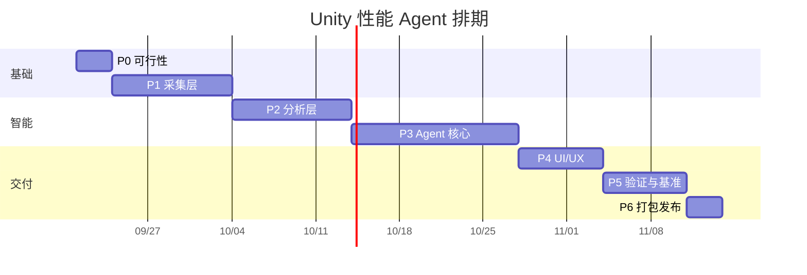
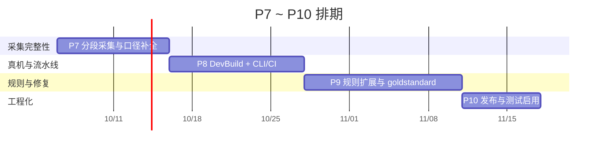

# Unity 内置性能排查 AI Agent —— 实施计划表

> 状态标记：✅ 已实现　🟡 部分实现　⬜ 待做

## 一、目标与设计原则

**目标**：在 Unity Editor 内提供可停靠的 Agent 面板，输入「我的游戏掉帧 / 卡顿 / 内存涨」，
它能自己抓 Profiler 数据、跑审计、定位根因、给出可执行修复方案。

| 原则 | 做法 | 反面案例 |
|---|---|---|
| **工具优先于模型** | 所有数值来自工具调用返回值，LLM 只负责编排与解释 | 让 LLM "估算" 帧耗时 → 必然幻觉 |
| **结论必须带证据链** | 每条诊断 = `{结论, 置信度, 证据[], 建议, 定位}` | "你的 Draw Call 太多了"（无数据、无阈值、无对比） |
| **无 LLM 也能用** | 规则引擎独立于 Agent，断网/无 Key 时退化为确定性分析报告 | Agent 成了 LLM 的壳，Key 挂了工具就废了 |

---

## 二、阶段计划

| 阶段 | 内容 | 工期 | 交付物 | 验收标准 | 状态 |
|---|---|---|---|---|---|
| **P0 可行性** | 锁定 Unity 版本；API 探针逐个验证 Profiler/内存/渲染 API；LLM 后端选型；UPM 包骨架 + asmdef 隔离 | 3 天 | API 可用性矩阵、EditorWindow 空壳 | 探针在目标版本全绿 | ✅ |
| **P1 采集层** | Profiler 抓帧与 `.raw` 加载；`ProfilerRecorder` 常驻；FrameTiming；渲染统计；内存/Temp Allocator；资源/场景/物理/脚本审计 | 1.5 周 | `PerfSnapshot` 模型 + 9 个采集器 | 一键抓 N 帧并序列化成 JSON | ✅ |
| **P2 分析层** | 规则库（阈值分级）；帧尖峰归因；性能预算资产 | 1.5 周 | 规则引擎 + 报告生成器 | 已知问题工程上命中率 ≥ 70% | ✅（5 类 gold standard 已建立） |
| **P3 Agent 核心** | LLM 接入（流式）；工具 schema 与调用循环；上下文压缩；幻觉校验；会话持久化 | 2 周 | 可对话的诊断 Agent | 结论一致率 ≥ 80%，无编造数值 | ✅（含会话持久化） |
| **P4 UI/UX** | 概览、Top 排行、问题卡片（可跳转）、一键修复、报告导出、会话对比 | 1 周 | 完整面板 + 导出 | 3 次交互内看到根因 | ✅（含快照对比页、一键修复计划） |
| **P5 验证与基准** | 5 类故障工程回归（GC Alloc 爆炸 / Draw Call 过多 / 纹理内存泄漏 / Temp Allocator 增长 / 物理配置错误）；建 gold standard | 1 周 | 评测报告 + 测试工程集 | 5 类全部定位到正确模块 | ✅（独立回归 11/11；Unity EditMode 测试已写好但默认不启用） |
| **P6 打包发布** | UPM 包、CI、README、示例工程 | 3 天 | `.tgz` 包 + 文档 | 空工程导入即用 | 🟡（UPM、CI、README、示例已完成；`.tgz` 待发布） |

**总工期**：约 8 周（1 人全职）。只做「无 LLM 的确定性分析器」可压缩到 4 周。

**里程碑**
- **M1（第 2 周末）**：能抓帧、能出离线报告 → 此时已是有用的工具
- **M2（第 4 周末）**：规则引擎定版，命中率达标
- **M3（第 6 周末）**：Agent 可对话、结论可追溯
- **M4（第 8 周末）**：可发布

---

## 三、Agent 工具清单（18 个，已实现）

| 工具 | 作用 | 限流 |
|---|---|---|
| `list_snapshots` / `load_snapshot` | 列出 / 加载历史快照 | 40 条 |
| `get_summary` | 环境 + 关键指标 + 结论概览 | 全量 |
| `get_metrics` | 全部标量指标（含预算对比） | 可过滤 |
| `get_frames` | 最慢的帧、尖峰帧号、与均值差异 | Top 8 |
| `get_markers` | Profiler Top Marker（自身耗时 / GC / 调用次数） | Top 15 |
| `get_findings` | 规则引擎结论（含完整证据链） | 可过滤 severity |
| `get_asset_issues` | 资源导入问题 | Top 20 |
| `get_scene_issues` | 场景/物理反模式 | Top 20 |
| `get_code_issues` | 脚本反模式（含隐私过滤） | Top 25 |
| `rerun_audit` | 改完资源/代码后重跑单项审计 | — |
| `run_rules` | 改预算后重新评估 | — |
| `diff_snapshots` | 两快照对比：按指标方向给出 regressed / improved 与整体 verdict | — |
| `get_budget` / `set_budget` | 读写性能预算 | — |
| `get_fix_plan` | 只读：获取带风险分级的修复计划（执行入口只在面板上） | — |
| `perf_*`（8 个，MCP） | 可选集成：把只读结论、静态审计与「跟随采集」暴露给外部 MCP 客户端（默认关闭；自动走 Play 测试与拖帧工具均已移除） | — |
| 一键修复（自动） | 资源导入 / 场景对象 / 工程设置 / 图集生成；**执行入口只在 Unity 面板**，MCP 只返回计划；代码类一律不自动改写，只给跳转与人工步骤 | — |
| `export_report` | 导出 MD / HTML | — |
| `probe_api` | 探测当前 Unity 版本 API 能力 | — |

---

## 四、技术选型（实际落地）

| 项 | 选择 | 理由 |
|---|---|---|
| Unity 版本 | 2021.3 LTS 起 | `ProfilerRecorder`(2020.1+)、`Physics.simulationMode`(2020.2+)、`UnityWebRequest.Result`(2020.2+) |
| UI | UI Toolkit | 数据密集列表渲染好；ImageGUI 只用于 SettingsProvider（框架要求） |
| JSON | 自写 `MiniJson` + `JsonUtility` | 零依赖。`JsonUtility` 不支持 Dictionary，故模型全部用 List + 可序列化类 |
| 异步 | `UnityWebRequest` + `DownloadHandlerScript` + `EditorApplication.update` 轮询 | 不依赖 UniTask / EditorCoroutines；SSE 流式可用 |
| 易变 API | 全部走 `Reflect` 反射适配 | 保证跨版本编译通过，拿不到就降级提示 |
| 配置 | `ScriptableSingleton` + `[FilePath]`（ProjectSettings 下） | 不进 Assets，避免导入与误提交 |
| API Key | 界面（EditorPrefs）优先，环境变量回退 | 不进版本库；界面优先避免「填了却被环境变量静默覆盖」 |
| 数据落盘 | `ProjectSettings/PerfAgent/` | 不污染 Assets、不进包体 |

---

## 五、性能预算表（诊断锚点）

绝对数值没有意义，**必须相对目标平台与预算判断**。已做成可编辑资产（`Project Settings > PerfAgent`）。

| 指标 | 移动端 60fps | PC 端 60fps | 触发等级 |
|---|---|---|---|
| 主线程帧耗时 | ≤ 12 ms | ≤ 10 ms | 超 80% 预算 Warn，超 100% Error |
| GC Alloc / 帧 | 0 B | ≤ 2 KB | 稳态非 0 → Warn；超预算 → Error |
| Draw Call | ≤ 150 | ≤ 800 | 视场景分级 |
| SetPass Call | ≤ 60 | ≤ 200 | 与材质数交叉验证 |
| Temp Allocator | 稳定，无单调增长 | 同 | 单调增长即疑似原生泄漏 |
| 纹理内存 | 按机型分档 | — | 超档位逐个列出违规资源 |

---

## 六、风险与对策

| 风险 | 影响 | 对策 | 落地情况 |
|---|---|---|---|
| Profiler API 跨版本不一致 / internal | 编译失败或读数错误 | API 探针 + 反射适配层，核心逻辑不依赖未文档化 API | ✅ |
| Profiler 内部数据第三方拿不到 | 用户误以为数据能与 Profiler 窗口等价 | 明确分级：确定性静态审计（不依赖 Profiler）/ 公开 API 实测 / internal 实验性；拿不到就不写指标并写明原因；托管分配双口径交叉校验 | ✅ |
| 抓帧本身有开销 | 测量结果失真 | 抓帧自动开关 Profiler 并复原；报告中标注 | ✅ |
| LLM 编造数值 | 工具不可信 | 工具优先 + 证据链 + 幻觉校验器（三道闸门） | ✅ |
| Token 成本 / 上下文爆炸 | 费用失控、超时 | 原始帧数据永不进 prompt；工具结果 12000 字符截断；`maxSteps` 上限 | ✅ |
| Agent 无限调用工具 | 卡死与费用失控 | `maxSteps` 到顶后强制去掉 tools 收尾 | ✅ |
| Editor 域重载丢状态 | 会话断掉 | 快照与对话均落盘；`PerfSession` 轻量不序列化 | ✅ |
| Editor 与真机差异大 | 定位错方向 | 支持 Dev Build + Autoconnect；`ProfilerRecorder` 可进 Player | 🟡（界面已提示） |
| 大工程扫描慢 | 编辑器卡住 | 资源审计只读 Importer 不加载资源本体；代码扫描跳过生成代码与超大文件 | ✅ |
| 启用 `testables` 触发 TestRunner 编译 | 工程里 test-framework 多版本共存时 TestRunner 挂到错误 NUnit，上千条 CS0246，连带包菜单不出现 | 包内测试放 `Tests~`（Unity 忽略），默认不进编译图；启用前先收敛 test-framework / ext.nunit 版本 | ✅（已隔离并文档化） |
| 一键修复把工程改坏 | 批量改导入设置可能让表现变差或物理失效 | 执行前弹窗列目标 + 风险分级；高风险动作（去碰撞体/关 BlendShape/标 Static）强制配人工确认；全部写变更日志并可撤销；没有执行器的问题不给执行按钮 | ✅ |
| 模型把“建议”当“已执行” | 报告与实际工程状态不符 | Agent 只有只读的 `get_fix_plan`，工具集里不存在修改入口；系统提示词明确要求“绝不修改工程文件” | ✅ |
| MCP 集成的编译期硬依赖 | 启用后卸载 MCP 包会编译失败 | 桥接独立成可选包（`PerfAgent.McpForUnity/`），主包保持零依赖；用 UPM 依赖（改 manifest 一行）开关，不搬文件、可随时回退 | ✅ |
| 长采集撑爆快照文件 | 300 帧只够 5 秒，跟随采集一局游戏几万帧，全量写进 JSON 会到几十 MB；而且抽取后 `frames.Count` 会显示错误帧数（18000 显示成 3000） | 落盘时均匀抽取到 3000 条而**统计仍用全部原始帧**；另加 `capturedFrameCount` 记真实采集量，避免界面与 MCP 读到抽取后的数量 | ✅ |
| 隐私顾虑 | 源码外传 | `localOnlyNoLlm` + 源码/路径上传开关，工具层强制过滤 | ✅ |

---

## 七、启动顺序建议（已验证）

先做 **P0 + P1 + P2**：一个「能抓帧 → 出带证据的离线报告」的纯工具。
这一步没有任何 AI 也立刻有使用价值，并且**顺带生产出 Agent 未来要调用的全部工具**。
等工具层稳了再接 LLM，风险最低、返工最少。

---

## 八、现状快照（2026-10 重构后）

> 这一节是「先读这里」。架构在 2026-10 做过一次方向性调整，下面这些结论与早期版本不同，
> 后续开发不要照旧印象改代码。

| 维度 | 现状 | 说明 |
|---|---|---|
| 数据来源 | **读 Profiler 面板已记录的帧** | `ProfilerPanel` + `ProfilerColumnLayout`；工具自己不做逐帧采样 |
| 采集入口 | **只有「跟随采集」** | 用户自己进 Play 操作，工具不控制 Play 模式；MCP 侧对应 `perf_follow_capture_start/_status/_stop` |
| Profiler 开关 | `ProfilerOwnership` 统一借还 | `SessionState` 记原状态 + `[InitializeOnLoadMethod]` 兜底归还；记录期间把面板历史上限压到 2000 帧 |
| 帧耗时 | 面板 `HierarchyFrameDataView` 的 PlayerLoop 行总耗时 | 取不到时退回 `frameTimeMs` 并注明 |
| 每帧分配 | 实测 − 编辑器开销基线 | 基线在编辑模式空转 ≤4 秒测中位数；拿不到就**不对该指标下结论** |
| 快照 | `ProjectSettings/PerfAgent/Snapshots`，支持单删 / 清空 | 保留个数 `keepSnapshots`（默认 20），落盘时均匀抽取到 3000 条 |
| 荒谬读数闸门 | 列分类 + 采样 + 规则**三道** | 纯小数 >2000 视为时间戳列；均值/P95/峰值 >2000 ms 直接拒绝 |
| 离线回归 | `Tests~/Standalone` **37/37 passed** | 纯 C#，`dotnet run -c Release`，不需要开 Unity |
| Unity 内测试 | 写好但**默认不启用** | `Tests~/` 带 `~` 完全被 Unity 忽略，避免 test-framework 多版本把编译管线拖死 |

**已删除的能力（不要写回来，除非有明确需求）**

| 已删 | 原因 |
|---|---|
| `FrameCapture`（自采样） | 采样回调本身就在给编辑器加开销，而它要测的正是「每帧开销」；且要一直维护帧缓冲 |
| `PlayModeTestRunner` / `PlayModeTestJob`（自动走 Play 采集） | 与「跟随采集」职责重叠，却要穿过两次域重载并落盘任务状态，维护成本高 |
| Agent 工具 `capture_frames` 与 MCP `perf_capture_start/_status` | 同上：采集入口收敛成一条 |
| 代码类一键改写（机械替换 / AI 补丁） | 改代码需要上下文，机械替换的收益不抵风险；现在只给「跳转 + 人工步骤」 |

---

## 九、后续阶段计划（P7 起）

### P7 采集完整性（最高优先）

面板帧历史只有约 2000 帧 —— 这是当前**最大的功能边界**：
「时长不限」只代表不会主动停，真正能分析到的只有最近一段。P7 把它补成真正可用的长采集。

| ID | 任务 | 交付物 | 验收标准 | 状态 |
|---|---|---|---|---|
| P7-1 | **分段采集**：跟随采集每积累 `HistoryFrames` 帧自动「切片收尾」（读一次、累计统计量），最后合并成一份快照 | `PanelCapture` 分段 + 数据合并 | 采集 10 分钟，快照 P50/P95/峰值与逐段统计吻合；内存不随采集时长增长 | ⬜ |
| P7-2 | 分段结果串成**时间线**（加载 / 战斗 / UI 各段分别给指标） | 快照 `segments[]` + 面板时间线视图 | 能给出「卡顿集中在中段（战斗）」这类结论 | ⬜ |
| P7-3 | 面板被清空 / 切换目标时**明确作废**并写原因（`lastFrameIndex` 回退） | 采样层闸门 + 提示 | 采集中清空 Profiler 不再产出无意义快照，而是写明「面板在第 N 帧被清空」 | ⬜ |
| P7-4 | 补齐缺失口径：**GC 触发次数**、**TempAllocator 增长** | 指标 + 提示 | 两项都能在面板序列与 recorder 之间交叉验证；拿不到时如实降级 | ⬜ |
| P7-5 | 采集自我保护：单次记录超过 N 秒或 N 帧自动收尾并提示 | 上限配置 + 状态栏提示 | 忘记点停止也不会一直记录（与 `ProfilerOwnership` 的历史上限形成双保险） | ⬜ |
| P7-6 | 实时曲线做到**逐帧**精度：先用 API 探针实测出当前版本里真正存在的帧耗时计数器名（`GetCounterValuesBatchByCategory` 名字不对也**不报错**，只会返回一列 0，所以必须实测后才能接） | 探针实测记录 + 计数器序列采样 | 曲线与快照里同一帧的耗时一致；名字测不出来就继续用现有口径并在界面上写明 | ⬜ |
| P7-7 | 实时波形与快照尖峰**对齐**：点报告里的尖峰帧号 → 波形上高亮那一段 | 交互高亮 | 能直接看到「报告说的那次尖峰」在曲线上的位置 | ⬜ |
| P7-8 | 复制能力补全：复制对话、复制「给外部 AI 的追问模板」（带上结论与证据链，便于接着问） | 两个复制入口 | 不装任何 LLM 也能把结论交给外部模型继续分析 | ⬜ |

### P8 真机与流水线（次高）

编辑器内的数字始终带编辑器开销；要让结论能对标真机，必须走 Development Build + Autoconnect Profiler。

| ID | 任务 | 交付物 | 验收标准 | 状态 |
|---|---|---|---|---|
| P8-1 | Development Build + Autoconnect Profiler：编辑器直连 Player 采集 | 连接管理 + 采集目标切换 | 采到的是**播放器帧**，编辑器开销基线自动置 0 并注明「真机口径」 | ⬜ |
| P8-2 | CLI / CI 模式：`-executeMethod PerfAgent.CI.StaticAudit -quit` 输出 JSON + 非零退出码 | CLI 入口 | 流水线能卡住「预算超标」的提交，不需要人开 Unity | ⬜ |
| P8-3 | 探针结果导出 JSON（版本能力矩阵） | `probe_api` 的 JSON 输出 | 换 Unity 版本后能 diff 出「哪些 API 没了」 | ⬜ |
| P8-4 | 性能预算预设（移动 / PC / 主机） | 预设资产 + 一键套用 | 不用手填十几个阈值 | ⬜ |

### P9 规则与修复面（中）

| ID | 任务 | 交付物 | 验收标准 | 状态 |
|---|---|---|---|---|
| P9-1 | 规则扩展：URP 后处理、Canvas rebuild / 合批、动画（Animator / Skinning）、粒子、Addressables 冗余 | 新规则 + 用例 | 每条新规则都有对应故障工程的回归用例 | ⬜ |
| P9-2 | gold standard 从 5 类扩到 10 类，并做**自动命中率评测** | 评测脚本 + 报告 | 命中率与误报率都是可回归的数字 | ⬜ |
| P9-3 | 修复面扩展：材质共享 / 变体、LOD、Mesh 压缩、图集合并策略 | 新修复执行器 | 每个执行器都有风险分级 + 可撤销 + 变更日志 | ⬜ |
| P9-4 | 多快照趋势对比（不只是两两 diff） | 趋势视图 + 导出 | 能回答「这三周是变好还是变差」 | ⬜ |

### P10 工程化与发布（低，但清单明确）

| ID | 任务 | 交付物 | 验收标准 | 状态 |
|---|---|---|---|---|
| P10-1 | 发布 `.tgz` + 版本号策略 + CHANGELOG | 发布包 | 空工程 `file:` 引用即用 | 🟡（P6 遗留） |
| P10-2 | 启用 Unity EditMode 测试 | 先收敛 `com.unity.test-framework` / `com.unity.ext.nunit` 版本，再开 `testables` | Test Runner 全绿，且**包菜单照常出现**（不能重现 CS0246 洪流） | ⬜ |
| P10-3 | 双语文档（中 / 英）+ 示例工程（含一个「故意慢」的场景） | 文档 + 示例 | 照着 README 能跑出同一条结论 | ⬜ |
| P10-4 | 把「当前是否由 PerfAgent 占用 Profiler 记录」显示到面板状态栏 | 状态条 | 用户能一眼看出记录是谁开的，不用猜 | ⬜ |

---

## 十、已知限制（如实列出，不藏）

| 限制 | 影响 | 缓解 / 计划 |
|---|---|---|
| 面板帧历史约 2000 帧 | 长会话只能分析最近一段 | P7-1 分段采集 |
| 基线在编辑模式测、采集在 Play 模式 | 「项目每帧分配」是**估算值** | 已加噪声带 `max(4 KB, 基线 × 25%)`；P8-1 走真机口径彻底去掉该项 |
| 帧耗时是编辑器内口径 | 绝对值不可直接对标真机 | 结论只做相对判断；P8-1 |
| Marker 排行依赖 internal 的列语义反推 | Unity 换版本可能失效 | 列分类有离线回归用例；失效时返回空 + 原因，绝不编数据；P8-3 用探针矩阵提前发现 |
| `GetAllStatisticsProperties()` 在 2022.3 identifier 全为 -1 | 「统计序列」这条路线不可用 | 已改走帧视图；探针里写明 |
| 无法在 Player 内跑诊断（除非 Dev Build） | 真机问题只能靠人复现 | P8-1 |
| Unity 内测试默认不启用 | 改动缺 Unity 侧回归保护 | 纯逻辑已由离线 37 项覆盖；P10-2 |

---

## 十一、下一步建议（如果只有半天时间）

1. **P7-3（面板清空检测）**：改动最小，直接消掉一类「产出无意义快照」的情况；
2. **P7-5（自动收尾上限）**：与刚做完的 `ProfilerOwnership` 配套，把「忘记停止」的后果关死；
3. **P7-1（分段采集）**：真正解锁「时长不限」，工作量最大但价值最高。

---

## 十二、需求基线（R1 ~ R4，2026-10 明确）

> 下面四条是用户明确提出的产品需求。后续排期要能对得上它们：
> **对不上的功能先不做** —— 这个项目的历史教训就是功能面铺得太宽、真要用的时候关键的几项反而没有。

| 需求 | 具体含义 | 现状 | 后续 |
|---|---|---|---|
| **R1 实时帧率波动** | 按下「跟随采集」后，面板里就能看到帧率在跳，而不是等采集完读一个数字 | ✅ 已实现：`CaptureLiveStats` + 面板顶部 4 Hz 波形（采完冻结保留），口径写在图旁边 | P7-6 逐帧精度、P7-7 与快照尖峰对齐 |
| **R2 分析所有影响性能的东西** | 不止帧耗时：分配 / GC / Draw Call / SetPass / 三角面 / 纹理与总内存 / 物理 / 动画 / UI / 粒子 / 资源导入 / 场景反模式 / 代码反模式 | 🟡 已覆盖 9 类采集 + 20+ 规则；**动画 / UI / 粒子 / Addressables 仍薄弱** | P9-1 规则扩展；先补齐「用户最常撞的几类」 |
| **R3 复制分析结果** | 一键把整份结论（含证据链与修复计划）复制走，能直接贴给别人或丢给外部 AI | ✅ 已实现：工具栏「复制结论」（与「导出 MD」同一份内容） | P7-8 复制对话、复制追问模板 |
| **R4 说清 AI 的价值** | 明确「为什么要接 AI 做 Agent」，而不是为了加 AI 而加 | ✅ 已写入 README「为什么要接 AI 做 Agent（以及没有 AI 时它是什么）」 | 保持纪律：每新增一项 AI 能力，都必须能回答「这条为什么规则做不到」 |

**R4 的一句话版本**：规则引擎负责「不撒谎」，LLM 负责「像个人一样帮你判断且能对话」。
凡是规则能确定性做到的事，都不交给模型（工具优先于模型，见第一节）。

对应的验收方式（不靠感觉）：

- R1：采集中界面每 0.25 秒必须刷新一次，且停止后曲线还在；
- R2：报告里的「影响项」要能逐条追到采集器或规则，不能出现无主的条目；
- R3：复制出来的 Markdown 能直接粘进 issue 而不用再排版；
- R4：README / 面板文案里任何一个 AI 入口，都要同时写清楚它比纯规则多做了什么。
