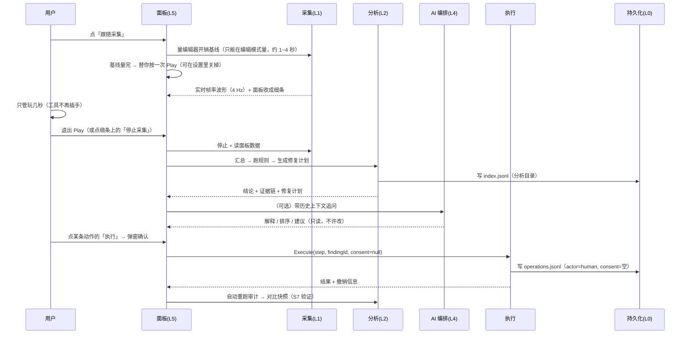

# PerfAgent 架构 / MCP 通道 / 加密 / 持久化 / AI SOP

> 本文是**唯一**的架构事实来源。模块怎么分、谁负责什么、AI 能做什么不能做什么、
> 加密与日志留在哪个接口，都以这里为准。`开发计划.md` 只负责排期，不重复这些约定。

---

## 一、一页总览

```
                        ┌──────────────────────────────────────────────┐
   人（Unity 面板）      │  L5 交互层   PerfAgentWindow / Settings / 探针 │
                        └───────────────┬──────────────────────────────┘
                                        │  只调下面几层的公开接口
        ┌───────────────────────────────┴───────────────────────────────┐
        │  L4 AI 编排层   AgentLoop（SOP 状态机）+ LlmClient + SopDefinition │
        └───────────────┬───────────────────────────────┬───────────────┘
                        │ 工具调用（只读）                │ 同意门（写操作）
        ┌───────────────┴───────────────┐   ┌───────────┴───────────────┐
        │ L3 通道层 ToolRegistry（Agent）│   │  L3'MCP 桥接层（可选包）    │
        │              —— 进程内，只读   │   │  perf_* 工具 + 同意凭据     │
        └───────────────┬───────────────┘   └───────────┬───────────────┘
                        │                               │
        ┌───────────────┴───────────────────────────────┴───────────────┐
        │  L2 分析层   PerfRuleEngine / PerfDiff / PerfFixPlan / 报告导出   │
        └───────────────┬───────────────────────────────────────────────┘
                        │
        ┌───────────────┴───────────────────────────────────────────────┐
        │  L1 采集层   PanelCapture + ProfilerPanel + 9 个采集器 + 实时波形 │
        └───────────────┬───────────────────────────────────────────────┘
                        │
        ┌───────────────┴───────────────────────────────────────────────┐
        │  L0 数据/持久化   PerfSnapshotStore · PerfHistory（JSONL/SQLite）│
        └───────────────────────────────────────────────────────────────┘

   贯穿各层的横切模块：ProfilerOwnership（资源借还）· SecretProtection（敏感数据）·
                       SopDefinition（流程与门禁）· PerfOperationLog（审计）
```

**执行层只在一个地方**：`PerfFixExecutor`。它是整份代码里唯一会改工程文件的类，
所有写操作都必须经过它，这样「同意门 + 审计 + 撤销」只需要在这一个点上守住。

---

## 二、模块职责（含「不负责什么」）

| 模块 | 负责 | **不负责（越界清单）** | 对外接口 | 关键文件 |
|---|---|---|---|---|
| **L1 采集** | 打开/归还 Profiler、确定帧窗口、读面板序列与帧视图、把结果汇总成指标 | 不分析、不下结论、不碰工程资源 | `PanelCapture.Start/Stop`、`ProfilerPanel.Read`、`CaptureLiveStats` | `Core/PanelCapture.cs`、`Core/ProfilerPanel.cs`、`Core/CaptureLiveStats.cs`、`Collectors/*` |
| **L2 分析** | 规则判定、跨快照对比、把一个结论翻译成「可执行动作 + 人工步骤」 | 不改任何东西；不产生没有证据的数值 | `PerfRuleEngine.Evaluate`、`PerfDiff.Compare`、`PerfFixPlan.Build` | `Analysis/PerfRuleEngine.cs`、`PerfDiff.cs`、`PerfFixPlan.cs` |
| **L3 通道（进程内）** | 把 L1/L2 的能力暴露成 Agent 工具，做限流、隐私过滤、结果裁剪 | **不提供任何写操作**；不解释数据 | `ToolRegistry.All()` | `Agent/ToolRegistry.cs` |
| **L3′ MCP 桥接（可选包）** | 把同一批能力暴露给外部 MCP 客户端；**未来承载「AI 操作」的唯一入口** | 不自己实现分析逻辑；不绕过同意门 | `perf_*` 工具 | `PerfAgent.McpForUnity/Editor/PerfAgentMcpTools.cs` |
| **L4 AI 编排** | SOP 阶段推进、组装上下文、调用工具、把结论讲清楚 | 不编数值；不越过同意门执行；不直接读写工程 | `AgentLoop.Ask`、`SopDefinition` | `Agent/AgentLoop.cs`、`Agent/SopDefinition.cs` |
| **L5 交互** | 展示、按钮、弹窗确认、复制/导出 | 不自己算分析结果；不绕过 `PerfFixExecutor` | `PerfAgentWindow` | `UI/*` |
| **执行** | 真正改工程：导入设置 / 工程设置 / 场景对象；记录可撤销的还原信息 | 只在人点了确认（或 MCP 带同意凭据）后才跑；不做「批量猜」 | `PerfFixExecutor.Execute/Revert` | `Analysis/PerfFixExecutor.cs`、`PerfChangeLog.cs` |
| **持久化** | 快照、分析目录、操作日志 | 不参与判定；写日志失败绝不中断主流程 | `IAnalysisStore`、`PerfHistory` | `Core/IAnalysisStore.cs`、`JsonlAnalysisStore.cs`、`Core/JsonlLog.cs` |
| **安全** | 敏感数据（API Key、导出包）的保护接口 | 现在**不加密**，只留替换点（见第五节） | `ISecretProtector`、`SecretProtection` | `Core/SecretProtection.cs` |
| **Profiler 借还** | 记录开关的 acquire/release、面板历史上限、域重载兜底归还 | 不关心业务；不做控制流 | `ProfilerOwnership.Acquire/Release` | `Core/ProfilerOwnership.cs` |

---

## 三、一次完整流程（含门禁与日志落点）



**门禁（S5）是硬边界**：AI 与 MCP 都只能停在「提出动作清单」，
只有人点确认（面板）或带着有效同意凭据（MCP 通道）才能走到 S6。

---

## 四、AI 操作通道：为什么必须是 MCP

### 4.1 不用 MCP 会怎样（如实说）

| 能力 | 没有 MCP | 有 MCP |
|---|---|---|
| 读数据、出结论 | ✅ 面板里可用（这已经比 Profiler 多：**规则 + 证据链 + 修复计划 + 对比**，不是一个汇总查询） | ✅ 同一个 `PerfPipeline`，数字完全一致 |
| **改工程** | ❌ 只能人自己点，AI 无从插手 | ✅ 外部客户端可发起，走同意门 |
| 让别的 AI（Claude Desktop / VS Code / CI）参与 | ❌ 每个客户端都要写一套适配 | ✅ 一套标准协议 |
| 流程可复用、可审计 | ❌ 每次都是人肉操作 | ✅ 调用即留痕 |

结论（也回应「你只是做了一个汇总查询」）：
**分析部分不是汇总查询** —— 9 类采集 + 20+ 规则 + 证据链 + 可撤销修复计划是实打实的工程；
但**「AI 操作」这件事，没有 MCP 就真的做不了**，因为没有一个标准化、可被外部客户端调用的操作通道。

### 4.2 MCP 通道的设计（P11 实施）

```
外部客户端 ── MCP ──► 桥接层（可选包）
                        ├─ 只读工具：snapshots / findings / metrics / fix_plan / static_audit
                        └─ 操作工具（新增）：
                             perf_list_pending_actions   ← 列出待执行动作（含风险/影响面）
                             perf_request_consent        ← 发起同意请求（在 Unity 面板弹出确认）
                             perf_execute_action         ← 必须带 consent_id，否则拒绝
                             perf_undo_action            ← 撤销，同样写审计
```

**三条不可协商的约束**（写在桥接层里，不靠提示词）：

1. **同意门**：`perf_execute_action` 必须带 `consent_id`；该 id 由人在 Unity 面板上
   点击确认后生成并有**有效期**（建议 5 分钟、一次性），没有它一律拒绝执行；
2. **审计**：每次执行/撤销都会往 `Log/operations.jsonl` 写一条，
   `actor=mcp`、`consent=mcp:<client>` —— 事后能回答「谁授意的」；
3. **降级安全**：桥接包没装 / MCP 没连上时，工具照常只读可用（面板功能不受影响）。

> 现状：桥接层目前**刻意只读**（没有任何写入口），操作工具是 P11 的内容 ——
> 也就是说「AI 操作」这条路现在是**预留好的、但还没开**。

---

## 五、加密与敏感数据：只留接口

**现状：不加密，但已经留好唯一替换点。**

| 项 | 现状 | 接入时怎么做 |
|---|---|---|
| API Key | `SecretProtection.Protect/Unprotect`（默认 `PlaintextProtector`：Base64 混淆，**明确标注不是加密**） | 注册一个真实现：Windows DPAPI / macOS Keychain / Linux libsecret；取不到就退回「不落盘，只读环境变量」 |
| 设置面板显示 | 显示当前实现名 + `⚠ 当前不提供加密保护` | 换实现后自动显示为已加密，用户看得见 |
| 导出包（`.perfagent`） | 文件格式已预留 `enc` 字段：`"plaintext"` | 用一次性对称密钥（AES-GCM）+ 口令派生（PBKDF2/Argon2）写入 `enc:"aes-gcm-v1"`，密钥随口令，**不用固定内置密钥**（那等于没加密） |

红线：
- 任何「以为加密了其实没加密」的状态都不允许存在（`IsEncrypting` 会显示给用户）；
- 密钥不写进版本库、不进快照、不进导出包；
- 隐私开关（`allowSourceCodeUpload`）与加密是两件事，都必须生效。

---

## 六、持久化与流程追溯

```
ProjectSettings/PerfAgent/
├── Snapshots/              完整快照（每次分析的结果）
└── Log/
    ├── index.jsonl         分析目录：哪次分析、什么场景、帧数、结论数、数据来源
    └── operations.jsonl    操作日志：改了什么、谁发起、谁同意、结果、能否撤销、是否已撤销
```

**为什么先用 JSONL（而不是直接上 SQLite）**

1. 需求是「追加 + 顺序读 + 给人看 + 给 AI 当上下文」，不是复杂查询；
2. 零第三方依赖是主包的既有承诺（引入 SQLite 要带原生库与平台分支）；
3. `type operations.jsonl` 就能读，也能整份喂给模型 —— 这正是「让 AI 有上下文」最省事的形态。

**换 SQLite 的路径**（接口已经留好）

```csharp
// 只要实现同一个接口，上层一行都不用改：
public class SqliteAnalysisStore : IAnalysisStore { ... }
JsonlAnalysisStore.Current = new SqliteAnalysisStore();   // 启动处替换
```
表结构直接照 `AnalysisIndexRecord` / `OperationRecord` 的字段建；迁移时用 JSONL 回灌。

**审计字段（最小集，必须都有）**

| 字段 | 含义 | 为什么必须有 |
|---|---|---|
| `utc` | 时间 | 排序与追责 |
| `actor` | human / ai / mcp | 区分「人做的」还是「AI 做的」 |
| `kind` / `actionId` | fix / undo / capture / export + 动作 id | 能对上代码里的执行器 |
| `consent` | 空 = 面板人工确认；`mcp:<client>` = 外部客户端批准的 | **回答「谁授意的」** |
| `success` / `changedCount` / `message` | 结果 | 失败也要留痕 |
| `canUndo` / `undone` | 能不能撤、撤了没 | 流程可回退 |

对 AI 的用法：`PerfHistory.Digest()` 会把最近的分析目录与操作日志压成紧凑文本，
自动注入系统提示词（含「同意来源」），让模型知道**已经做过什么、被谁批准过**，
而不是每次从零开始猜。

---

## 七、AI SOP（标准操作流程）

> 前提：**AI 不可能不出错**。所以流程不靠「提示模型要谨慎」，而是靠阶段 + 白名单 + 门禁 + 日志。

| 阶段 | 输入 | 允许的工具 | 输出 | 门禁 |
|---|---|---|---|---|
| **S1 目标确认** | 用户描述（掉帧 / 卡顿 / 内存涨） | `list_snapshots` `load_snapshot` `get_budget` | 要查什么、范围是什么 | 目标不明确就先问，不许瞎查 |
| **S2 采集（人操作）** | — | **无**（MCP 侧不控制 Play） | 引导用户点「跟随采集」：面板会量基线并**自动进 Play** 开始记录，用户只管玩 | 自动进 Play 只属于**人类按钮**的行为（可在设置里关）；MCP / AI 侧**没有**进 Play 的入口 |
| **S3 只读分析** | 快照 | `get_summary/metrics/frames/markers/findings/asset_issues/scene_issues/code_issues` | 结论候选 + 证据 | 没有证据不下结论 |
| **S4 提方案** | 结论 | `get_fix_plan` `diff_snapshots` `run_rules` `rerun_audit` | 动作清单（目标 / 影响面 / 风险 / 回滚） | 每条动作必须四要素齐全 |
| **S5 等同意** | 动作清单 | **无** | 交给用户确认 | **停**。AI 不得自行继续 |
| **S6 执行** | 同意凭据 | 面板按钮 / MCP `perf_execute_action(consent_id)` | 执行结果 + 撤销信息 | 无凭据一律拒绝 |
| **S7 验证** | 执行后的工程 | `rerun_audit` `diff_snapshots` `get_metrics` `get_findings` | 改善 / 没变 / 变差 | 不许跳过验证就宣布成功 |
| **S8 交付** | 结论 + 过程 | `export_report` `get_fix_plan` | 报告（可复制 / 可导出） | 数据局限要写清楚 |

**硬规则（代码里就是 `SopDefinition.HardRules`，面板可见）**

1. R1 没有证据不下结论：数值只能来自工具返回，禁止估算；
2. R2 数据不足写「无法归因」，不给偏小的数充当结论；
3. R3 改工程前必须给出：目标 / 影响面 / 风险等级 / 回滚方式；
4. R4 没有人工同意不得执行，同意来源必须写进日志；
5. R5 执行后必须验证并把结果写回日志；
6. R6 失败如实报告，不许用重试掩盖；改一半必须能撤销；
7. R7 原始帧数据不进上下文；
8. R8 隐私开关生效时不外传源码片段与绝对路径。

**失败处理**：任一阶段失败 → 写日志（`success=false` + 原因）→ 能回退就回退（`undo`）
→ 把「哪一步失败、当前工程处于什么状态」如实告诉用户，不进入下一阶段。

---

## 八、扩展点：想做 X，改哪里

| 想做的事 | 改哪个文件 | 满足的接口 | 验收 |
|---|---|---|---|
| 加一类采集（如动画 / 粒子 / Canvas） | `Collectors/` 新增采集器 | `IPerfCollector` + 注册到 `CollectorRegistry` | 出现在「明细」标签，且报告能引用 |
| 加一条规则 | `Analysis/PerfRuleEngine.cs` 加 `EvaluateXxx` | 用 `New/Ev` 造结论与证据 | 有对应 gold standard 用例 |
| 加一个 Agent 工具 | `Agent/ToolRegistry.cs` | `Tool(name, desc, Schema, impl)` | 同步实现；写操作一律不许加 |
| 加一个 MCP 工具 | `PerfAgent.McpForUnity/Editor/PerfAgentMcpTools.cs` | `[McpForUnityTool]` | 只读 / 或带同意凭据 |
| 加一个可执行修复 | `Analysis/PerfFixExecutor.cs`（或 `PerfFixExecutorExtended`） | `CanExecute` + 还原信息 | 风险分级 + 可撤销 + 写审计 |
| 换持久化后端 | 实现 `IAnalysisStore` | 替换 `JsonlAnalysisStore.Current` | 面板显示后端名；迁移脚本可回灌 |
| 接真加密 | 实现 `ISecretProtector` | `SecretProtection.Register(...)` | 设置面板显示已加密；导出包 `enc` 字段变化 |
| 换 LLM 供应商 | 无（OpenAI 兼容即可） | `LlmClient` | 「测试连接」通过 |
| 加 UI 视图 | `UI/PerfAgentWindow.cs` 加标签 | — | 只调下层接口，不自己算数 |

---

## 九、与开发计划的对应

- **P11（AI 操作通道与治理）**：MCP 操作工具 + 同意门 + 凭据 + 审计 + SOP 状态机落地 + SOP 标签页；
- **P12（数据与安全）**：SQLite 后端（可选）、真加密实现、导出加密包 `.perfagent`；
- 现状与已完成项见 `开发计划.md` 第八、九节。

---

## 十、假问题防线：宁可不说，也不报假问题

工具的信任是一次性的：**报一次假问题，之后每个数字都要被怀疑。**
所以每条诊断规则都必须能回答「这个数字凭什么算在项目头上」。下面是现行闸门，以及它们各自挡掉的真实假问题。

### 10.1 每帧托管分配：三道闸门 + 一个佐证

`GC Allocated In Frame` 是**整个编辑器进程**口径（Game View 渲染、URP、Profiler 记录、Inspector 刷新全在里面）。
本机实测的空工程数据：

| 量 | 值 | 说明 |
|---|---:|---|
| 编辑模式空闲基线 | 465 B/帧 | 采集前空转实测，中位数 |
| Play 模式实测（SampleScene，4 Light / 24 Draw Call / 无用户脚本） | 14435 B/帧 | 全进程口径 |
| 残差（实测 − 基线） | 13970 B/帧 | 曾经被当成「项目自身分配」报成**严重** |

残差里绝大部分仍然是编辑器自己 Play 模式下的开销 —— 编辑模式基线（几百 B）与 Play 模式实际开销（一万多 B）
根本不是一个量级。所以现在要同时满足**四个**条件才会报「项目每帧分配超预算」：

1. 残差 > 播放器预算（`maxManagedAllocBytesPerFrame`，默认 2048 B）；
2. 残差 > 基线噪声带（`max(8 KB, 基线 × 25%)`）；
3. 残差 > **归因地板** `PerfBudget.editorPlayModeOverheadBytes`（默认 16384 B，可在预算里调）——
   低于这个量级时，工具在编辑器里**无法**把它与编辑器开销区分开；
4. 采集窗口 ≥ 30 帧（见 10.3）。

过不了闸门时不产出结论，而是在附录里写清楚「数字是多少、卡在哪道闸、怎么确认（用 Player 构建版复核）」。
脚本扫描命中的每帧分配反模式只作为**佐证**：命中则置信度 0.8 并在说明里写出来，没命中则降到 0.6 并说明
「第三方代码 / 反射扫不到」——它不作为闸门，因为扫不到不等于没问题。

### 10.2 零值不当实测用

`ProfilerRecorder` 的单点读数在编辑器里经常读出 0（计数器只在 Profiler 采到对应数据时才有值）。
以前这些 0 会被当成实测写进报告，于是同时出现「Draw Calls 0 次（预算 300）」与「Draw Calls 均值 24 次」，
以及「纹理数量 0 个 / 网格数量 0 个 / 对象总数 0 个」这种脏行。现在的规则：

- **面板序列（整段窗口）优先**于单点读数，同一计数器的单点读数不再覆盖它；
- 单点读数 ≤ 0 一律按「读不到」处理，并在附录里列出是哪几个计数器、为什么；
- `GC.MaxGeneration` 这类被误用成「堆上限」的指标直接删除（它是 GC 代数编号 0/1/2，不是字节数）；
- **逐帧表里的「分配」列一律不能印 0**：实测报告与面板都直接抄了 `managedAllocBytes`
  （`GC.GetTotalMemory` 差值那个弱口径，面板采集路径上恒为 0），于是「最慢的 10 帧」表里
  133 ms 的卡顿尖峰被展示成「分配 0 B」。现在取 `FrameStat.DisplayAllocBytes`
  （面板序列优先，拿不到返回 -1）→ 显示「—」；平均分配走 `PerfSnapshot.AverageAllocPerFrame(out caliber)`，
  拿不到就写「不可用」而不是 0（0 B/帧 会被当成「零分配」这个好消息）。

### 10.3 样本量不足不下统计结论

跟随采集只录到 10 帧（约 0.7 秒）时，工具仍然给出过
「均值 2.28 / P50 2.27 / P95 2.3 / 峰值 2.3 ms」与「FPS 438」——
2 帧算出来的 P50/P95/峰值必然**完全相同**，看着精确，实际没有任何信息量。现在：

- 窗口 < `PerfSnapshot.MinFramesForStats`（30 帧）时，规则侧跳过依赖样本量的结论
  （帧耗时、抖动、分配），改为产出一条 Info 结论说明原因，**并写明「这份数据不能用来和其它快照做前后对比」**，
  并在快照提示里建议「多操作几秒」；
- 不依赖帧数据的结论（资源导入、场景、代码、物理配置）**照常给出**，不受影响；
- 报告表头把「窗口帧数」与「逐帧明细抽样数」分开写，不再让「采样 2 帧」被误读成「只录了 2 帧」。

### 10.4 幻觉校验只看叙述，不扫数据表

报告的「未验证数值」清单原本是对**整篇文本**做的数字对账，于是把采集器写进去的事实
（`2026`（年份）、`5060`（显卡型号）、`7632`（帧号））全列成了「可疑数字」，一屏噪声。
现在这个校验只作用于**规则/LLM 写出来的叙述**（结论标题、说明、建议）；采集器写入的数据表作为「已对账」来源。
Agent 通道（`AgentLoop`）传进来的是 LLM 文本，仍然按整篇校验 —— 那才是它真正要防的场景。

### 10.5 「没数据」必须比「没问题」更醒目

比报假问题更坏的一种情况是：**什么都没有报，读者却以为排查过了**。实测踩过一次：
用户采了两份快照（优化前 / 优化后）来做对比，两份报告长得一模一样、都只剩资源类结论 ——
因为两份都**一帧都没采到**（Profiler 没在记录），而当时的规则侧对 `window <= 0` 是**直接 return**，
连一条「样本不足」的提示都没有（那是 10.3 的路径，它要求 `window > 0`）。

现在的口径：

- 窗口为 0 帧 → 产一条 **Error 级**结论 `capture_no_frames`（含证据链：采集窗口帧数 = 0），
  并写明「这份数据不能用于优化前后的对比」；
- 报告头部「采集窗口」直接写 **无帧数据**，下面紧跟一段引用块提醒；
- 采集**进行中**就提醒：超过 2 秒 `lastFrameIndex` 还是 -1 就往 Console 打一条 Warning
  （附带 `enabled` / `profileEditor` / `historyLength`），别等用户玩完才告诉他白采了；
- 报告头部加一列 `PerfAgent vX.Y.Z（程序集 时间）` —— 编辑器源码编译失败时会在**旧程序集**上继续跑，
  那个字符串能一眼分辨报告是哪个版本产的（实测：两份报告的提示串在新源码里早已不存在）。
  版本号优先取 UPM 包 `package.json` 的 version（`PackageInfo.FindForAssembly`，退到直接读文件）：
  asmdef 里没写版本时程序集版本恒为 **0.0.0.0**，实测报告头一直印着这个没意义的数字。

### 10.6 「窗口只有几十帧」的根因：面板历史 + 暖机

实测：两份跟随采集的报告窗口分别只有 **44 / 10 帧**（都已丢弃开头 256 / 290 帧），
连统计门槛都过不去 —— 而两个快照的总帧数都恰恰好是 **300 帧**。链条是：

1. `ProfilerOwnership.Acquire` 原来写的是 `if (MaxHistoryLength > HistoryFrames) MaxHistoryLength = HistoryFrames;`
   —— **只在面板历史更大时才压小，小了不往上改**。而 `ProfilerApi.MaxHistoryLength` 的
   getter 在反射取不到 `maxHistoryLength` 时返回兑底值 **300**，于是 300 < 2000 → 不设置，面板只留 300 帧；
2. 300 帧在高帧率（~260–290 fps）下就是 1 秒，而 `TrimWarmup` 按「秒 × 中位帧耗时」换算要丢的帧数，
   旧上限「至少留 10 帧」于是把窗口裁到只剩 10 帧 → 低于 30 帧门槛 → 动态结论全部跳过。

现在的口径：

- `Acquire` 把面板历史调到 `!= HistoryFrames` 就写（往上往下都写），并**回读确认**；
  调不动就每次记录只打一次 Warning（写清当前值、建议的采集时长），不再静默；
- `TrimWarmup` 改为「暖机最多吃掉一半窗口、且至少留下 30 帧」，被限制时在快照备注里写明
  「暖机只丢了开头的 N 帧（否则就没帧可分析了）」。

两条一起卡的价值：**即便面板历史真的只有 300 帧，也拿得到上百帧可用数据**，不会退化成「无可对比」。

### 10.7 「一直记录 0 帧」：面板帧号是按 Profiling 会话递增的

实测（用户报「为什么一直记录 0 帧」）：采集明明在跑，帧数就是不动 —— 玩多久都是 0，
收尾时还会被判成「采集期间没有新帧」。

根因：`ProfilerDriver.firstFrameIndex / lastFrameIndex` 是**按 Profiling 会话**递增的，
进/退 Play 或清空帧数据之后会**从头开始**。而采集起点是「开始那一刻读到的帧号」——
如果面板里还留着上一个会话的帧（用户自己开过的 Profiler、工具上一轮没清），起点就是一个**很大的旧号**；
新会话从 0 开始后 `last - startFrame` 恒为负，于是帧数永远是 0。

现在的口径（`CaptureWindow.RebaseOnSessionRestart`，纯逻辑、有离线回归）：

- 面板已有帧且 `last < startFrame` = 帧号往回跳 = 会话重启 → 起点重定到面板里最早的一帧，
  并把起点标为回推（快照备注写明「窗口可能含采集开始前后的少量帧」）；
- 实时曲线 `CaptureLiveStats` 同样重定 `StartFrame`，否则界面上的「已记录 N 帧」也是 0；
- 细条/面板上**持续 2 秒 0 帧就把原因写出来**（`enabled` / `lastFrameIndex` / 一句「到 Profiler 窗口点 Record」），
  完整状态进 tooltip —— 「采集在跑、数字不动」时用户分不清是工具坏了还是 Profiler 没录，
  不能只靠 Console 里的一条 Warning。

**踩过的第二个坑：`ProfilerDriver.enabled` 的读法把排查带偏了。**
`ProfilerApi.Enabled` 的 getter 为了兼容写成了 `enabled || profileEditor`（历史代码里想让
「Profiler 窗口开着」也算在录）。结果是「`profileEditor=true`、`enabled=false`」这种状态
**被读成「正在记录」**，于是 0 帧时的报错说「Profiler 在记录但没写出帧」——方向完全错，
真正该做的是把 `enabled` 打开。现在的口径：

- 新增 **`ProfilerApi.EnabledRaw`**（只读 `enabled`，不做任何兜底）与 `EnsureEnabled()`（写后读回校验），
  诊断 / 报错 / 自愈一律用 `EnabledRaw`；合并读法只留给「人看的探针输出」；
- `ProfilerApi.RestartRecording(ensureEditorTarget)`：清帧 → `enabled=false` → 重新开启 → 按需切记录目标，
  用于把偶发的「开着但什么都不写」的僵死记录会话换掉（现在只有记录目标阶梯会调它）；
- 采集期间 0 帧：2 秒时先打一条提示（说明正在实测），4.5 秒左右由阶梯给出结论
  （「第 N 种目标开始出帧」或「三种都无效，不是目标的问题」）；只报一次，
  免得采集期间刷日志产生分配、污染测量；
- API 探针里 `enabled` / `profileEditor` / 合并读法**分开列**，避免再次误判。

**第三个坑（未完全定性）：`profileEditor` / 记录目标到底该取什么值，文档没写 —— 所以不猜，按顺序实测。**

现场日志（2026-10-07）：`enabled=True，profileEditor=False，historyLength=300，firstFrameIndex=-1，lastFrameIndex=-1` ——
`enabled` 开着，面板一帧都没写；而且用户手动打开 Profiler 窗口后，窗口里也是空图、`Frame: 0 / 0`。

第一版处理是**猜的**（断定「Play 下也必须 `profileEditor=true`，所以采集一开始就强行切目标」），
依据只是「`enabled` 与目标两个开关里，后者看起来不对」。这个断证站不住：
同一天用户手动开 Play 能采到帧（同一个代码路径），而且他 Profiler 窗口左上角的目标下拉是
**`Play Mode`** 而不是 `Editor` —— 这两个目标在 `ProfilerDriver` 里怎么映射，官方文档里查不到。
强行切目标的风险很具体：**可能把本来能用的路径反而弄坏**。

现在的口径（`Utils/RecordingTargetLadder.cs`，纯逻辑 + 离线回归）：

- 采集开始**不动用户的目标**（`Acquire(false)`）；
- 面板一帧都不写时（此时清帧历史是零代价）按顺序实测三种组合，每种观察 1.5 秒：
  ① 不动、② 切 `profileEditor=true`、③ 切回 `profileEditor=false`；
- 哪一步开始出帧就停在那里，并把「**这份数据是在哪种目标下录的**」写进日志与快照备注；
- 三种都无效 → 明确写「**不是目标的问题**」，把注意力引向环境（内存告急 / Profiler 被暂停 / 刚编译完），
  而不是让用户继续折腾目标开关。

> 教训（比结论重要）：**没有可靠依据时不要做「强行修正」，要做「有记录的实测」。**
> 强行修正如果猜错了，会把用户本来能用的路径一起弄坏，而且日志里看不出哪一步是猜的；
> 阶梯式实测即使结论是「都不是」，也把搜索空间真实地缩小了一圈。

配套：API 探针里的 **【1b】ProfilerDriver 静态成员真值**（`ProfilerApi.DumpDriverStatics`）
把该类的全部静态属性/字段的真实值列出来 —— 下次再遇到「目标该取什么值」的问题，
不再靠记忆与推理，直接看真值。


### 10.7b 跟随采集没有帧数上限：别把「安全阀」当结束条件

实测反馈（2026-10-07）：「跟随采集 20000 帧左右会自动退出采集」—— 这正是
`FollowCapture.MaxFrames`（当时是 `PanelCapture.targetFrames` 的取值）触发了 `Stop`。

为什么它是错的：**真正的上限是 Profiler 面板自己的帧历史**（`HistoryFrames=2000`，
实测有的机器卡在 300）。采到 2 万帧时，前面 1.97 万帧早就被面板丢掉了 ——
在 2 万帧停止并不能「保住」任何数据，只会：

- 在用户玩到一半时把采集掐断（而界面上写的是「时长不限」）；
- 让「已记录 20000 帧」这句话**骗人**：报告实际只覆盖最后几百帧。

现在的口径：

- 跟随采集的结束条件只有两个：**你退出 Play**、或**你点停止**（`PanelCapture(0, …)`）；
- `MaxFrames` 降级为**软上限**：只在日志里提示一次「面板只保留最近 N 帧，窗口会跟着滚动」；
- 帧数显示一律过 `CaptureWindow.CountLabel(采到的, 面板保留的)`：
  采得比保留量多时写成「已记录 20000 帧（面板只保留最近 300 帧，分析用这 300 帧）」，
  细条上用短写法「已记录 20000 帧 · 窗口 300 帧」（细条只有一行，长句会把 FPS 挤到看不见）；
- 收尾时如果起点已被面板挤出历史（`FirstFrameIndex > startFrame + 1`），
  快照备注里写明「结论描述的是**最近这一段**，不是玩的全程」；
- `ProfilerPanel.Read` 本来就把 first/last 夹到面板可用范围，所以长会话不会读到不存在的帧。

> 口径教训：**「安全阀」不能伪装成产品行为。** 如果某个上限是工程约束（内存/历史长度），
> 就把这个约束**如实写到界面上**（这里显示「分析用最近 300 帧」），而不是偷偷把采集停掉 ——
> 后者既保不住数据，又让用户以为工具坏了。


### 10.8 工程级扫描必须按「当前场景目录」分组

同一个工程里可以同时存在同一玩法的多份副本（本仓库的 `Assets/PerfAgentSample/{Before,After}` 就是），
而静态扫描是工程级的（`Assets/**/*.cs`）—— 不分组的后果是：两份报告的「代码问题数」完全一样，
**优化前后对比直接失效**（实测：两份都写 60 处，而且 Before 的报告里列着 `After/Scripts/*`）。

现在的口径：

- 采集时算出「当前场景所在目录」（场景父目录叫 `Scenes` 就取它的上一层，否则取场景自己那层），
  写进 `PerfSnapshot.codeScopeRoot`，并给每条 `CodeIssue` 打上 `inSceneScope`；
- 指标表多一行 **「代码问题数（当前场景目录）」** —— 前后对比只看这一行；
- 代码类结论的证据里加一条「分组（当前场景目录 / 其它目录）」；**全在其它目录里的那种写法**
  降为 Info 并写明「不属于本次采集的场景目录」；跳转目标优先指向属于当前场景的那一条；
- 报告代码表给属于当前场景的行加 **★**，表上方写明它的含义。

判定必须用快照级的 `codeScopeRoot` 而不是「至少有一条问题命中」：完全可能本次采集的这份代码
恰好一条问题都没有，而问题全在另一份副本里 —— 那正是最需要区分的场景。

### 10.9 闸门口径必须跟着数字一起出去（一次真事故）

实测（After 副本，快照 20261006_210811）：`get_code_issues` 返回 `total=0`，
而 `get_metrics` 里「每帧托管分配 14443.6 B」摆着预算 2048 B —— AI 直接算出
「**超标 7.05 倍**」写成第一条结论，同时抱怨「扫描是 0，无法归因到任何位置」。
两个都是同一类故障：**结论（或者「不算结论」）没有跟着数字一起交给出口**。

- 14443.6 B 是**含编辑器自身开销**的口径（空场景 Play 模式实测就有 14435 B/帧），
  拿它除播放器预算是口径错误；规则引擎早就按归因地板 16384 B 把这个残差（13978.6 B）压掉了；
- `get_code_issues` 的 0 处是对的（After 本来就改完了），但工具没给覆盖率与作用域，
  0 与「扫描没跑」长得一模一样，只能靠人猜。

现在的口径：**闸门也是数据**。

- `PerfGate` + `PerfSnapshot.gates`：每个被闸门拦下的数字都留一条记录
  （指标名 / 状态 / 值 / 阈值 / 一句可直接引用的人话），另有「含编辑器开销的口径提示」
  与「拿不到归因数据」两种留痕（否则「没有分配结论」会被读成「分配没问题」）；
- 四个出口说同一句话：MCP（`get_metrics` / `get_summary` 的 `gates`，数字旁还挂 `gate`）、
  本地回答（「这些数字没被算成问题（闸门口径）」）、报告（「闸门口径」一节）、
  LLM 底稿（`BriefForPrompt` 末尾）；底稿与工具里都明写
  「不要自己用『实测值 ÷ 预算』算倍数」；
- `get_code_issues` 返回 `scan_coverage`（已扫描 N 个脚本 / 当前场景目录 X 处 / 其它 Y 处），
  0 处时附上「0 处不等于没有分配点」的扫描边界说明；扫描压根没跑时直接说
  「已扫描 0 个：扫描没跑或被全部跳过」。

教训：**只要一个数字旁边有预算/阈值，就必须同时给「这次的判断结论」**。
给了数字不给判断，等于邀请每一个读者（包括模型）自己重算一遍，
而他们不知道你手里那三道闸门。

### 10.10 验收方式

每条闸门都有一条实测回归用例钉住（`Tests~/Standalone`，`dotnet run -c Release`，共 91 项）：

| 用例 | 钉住的行为 |
|---|---|
| `EmptyProjectPlayModeAllocStaysUnattributed` | 空工程残差 13970 B/帧 不得报成项目问题，且必须写出卡在哪道闸 |
| `TinyCaptureWindowSuppressesSampleDependentVerdicts` | 10 帧窗口不得产出帧耗时结论，只说明样本不足 |
| `EditorOverheadIsNotReportedAsProjectProblem` | 基线很大时（97409 B）残差不得报 |
| `ProjectAllocAboveNoiseBandStillFires` | 残差真的很大时（60 KB）仍然要报，且带完整证据链 |
| `MissingBaselineSuppressesPerFrameAllocVerdict` | 没有基线时不得给分配结论 |
| `ZeroFrameCaptureIsReportedAsError` | 一帧都没采到时必须报 Error 结论（有帧的快照不得报） |
| `CodeFindingsAreSplitBySceneDirectory` | 只属于其它副本的代码问题降为 Info、给出 0/1 与 1/1 分组证据、跳转指向当前副本；无标记（旧快照）行为不变 |
| `AllocGatesAreRecordedForEveryOutcome` | 分配闸门的三种结局都留记录（未过归因地板 / 通过 / 缺数据），含口径提示；底稿与本地回答都必须带上闸门口径 |
| `CodeScanExplanationSelfProvesZero` | 扫描 0 处必须自带覆盖率与作用域；扫描没跑时不能只说「0 处」 |
| `EventCallbackFindingsAreNotCalledPerFrame` | 碰撞/触发回调里的写法不得说成「每帧方法中出现」，级别封顶到警告，证据里写清执行时机 |
| `FrameAllocDisplayNeverFakesZero` | 逐帧分配取面板序列（不是恒为 0 的弱口径），拿不到返回 -1/NaN 并由调用方印「—」「不可用」 |
| `StripGeometryGuardsAgainstTinyRestore` | 细条尺寸不得被当成「收起前的尺寸」（否则采集结束会恢复成一个废窗口）；尺寸串解析拒绝 0x0 / NaN / 字段数不对 |
| `SessionRestartRebasesTheStartFrame` | 面板帧号往回跳（会话重启）时必须重定采集起点，否则帧数永远是 0；正常递增时不得乱动起点 |
| `LiveStatsRebaseOnFrameIndexRestart` | 实时曲线同样重定起点，重启后从新起点重新起算而不是恒为 0 |
| `AutoPlayGateEnterPlayOnlyWhenItShould` | 自动进 Play 的四种情形：设置关掉 / 已取消 / 已在 Play / 正在切换，一律不许动手 |

---

## 十一、本地规则引擎 vs LLM：能力边界与硬闸门

用户会问「规则引擎是啥、为什么本地模式还能回答我的问题」。这一节把话说明白，代码里也按这个执行。

### 11.1 规则引擎是什么

`Analysis/PerfRuleEngine.cs`：拿快照的指标跟预算逐条比，产出**带证据链的结论**
（每条结论都挂着「哪个工具、哪个指标、什么值、对比什么阈值、来源是谁」）。
它不联网、不调用任何模型、不做语言理解 —— 这是整个工具的底座：断网、无 Key、纯本地模式下
它照常工作，所以「结论可回溯」这件事不依赖 AI。

### 11.2 本地模式下的提问是怎么被回答的

`Analysis/LocalAnswer.cs`，只做两件事：

1. **关键词路由**：问题里出现「内存/分配/GC」就命中内存维度，「帧率/卡顿/掉帧」命中帧率维度……
   维度表把「用户会怎么问」映射到「规则把结论归到哪一类」；
2. **摆证据**：把该维度的结论（含证据链与建议）与相关指标列出来。

回答的开头会写明「命中维度：X（按关键词匹配，不做语义理解）」，结尾会写明自己做不到什么。
样本不足（窗口 < 30 帧）时会先把这件事说清楚 —— 否则用户问「为什么卡」只会得到
「你问的维度上没有结论」，看起来像工具坏了，而真正的原因就躺在快照里。

### 11.3 纯本地模式是「发字节那一层」的硬闸门

`localOnlyNoLlm` 必须在**能建请求的地方**生效，而不是只改 UI 文案：

- `LlmClient.Send(...)` 第一件事就是检查 `localOnlyNoLlm`，命中则直接回调错误、不建请求；
- `SendRaw(...)`（真正 new `UnityWebRequest` 的地方）**再挡一次**，防止以后有人绕过 `Send`；
- 面板对话在 `Send()` 里就先分流：纯本地模式 / 没配 Key → `LocalAnswer`，压根不走 Agent 循环。

> 踩过的坑：早期只在面板里判断了「有没有 Key」。于是「开了纯本地模式 + 配过 Key
>（含 `DEEPSEEK_API_KEY` 这类环境变量，配置里会自动认）」时，请求会**真的发出去** ——
> 开关承诺不联网却联了。隐私开关必须与传输层同寿，不能活在 UI 里。

### 11.4 两条路各自能干什么（产品口径）

| | 本地规则引擎 | LLM 追问 |
|---|---|---|
| 联网 | 不联网 | 会联网（由用户显式开启） |
| 结论来源 | 快照 + 预算规则，可逐条回溯 | 在工具结论之上做解释与推理 |
| 能理解自由表达 | 不能（只做关键词匹配） | 能 |
| 跨维度推理（「为什么只有战斗时卡」） | 不能 | 能 |
| 断网 / 无 Key | 照常工作 | 不可用 |
| 适合 | 「这个数字多少 / 有没有超预算 / 证据是什么」 | 「为什么会这样 / 我该怎么改」 |

`Tests~/Standalone/LocalAnswerTests.cs` 把 11.2 的行为钉住了：关键词确实把问题带到对应维度、
未命中的问题不得假装听懂、样本不足必须解释原因。

### 11.5 让「用不用 AI 的差别」当场可见

用户提过一句很实在的话：「我看不出用不用 AI 的区别」。根因是**两条路的输出长得像**：
本地模式把规则结论列一遍，AI 模式也让模型把同样的结论复述一遍，而且聊天气泡上的标签还都写着「Agent：」。
现在改成：

1. **每条提问都先贴「本地规则引擎」块**（命中维度 + 结论 + 证据 + 相关数字），不管有没有开 AI ——
   它是事实底座，AI 不应该重算它；
2. 开了 AI 时，下面**再加**一块「AI 解释（模型名）」：只答本地给不了的部分
   （为什么会这样 / 优先级怎么排 / 具体怎么改），并在问题里**明确要求不要复述结论**；
3. LLM 拿到的不是原始快照，而是一份 `LocalAnswer.BriefForPrompt` 事实底稿
   （命中维度 + 结论要点 + 可引用数字 + 证据行 + 「不要凭空推测」）。
   于是回答里引用的数字与本地一致，也省掉一轮工具调用；
4. 聊天区加了一行示例问题，**在提问前**就标出哪些「需 AI」：
   「帧耗时超预算了吗？」（本地可答）/「为什么只有战斗时才卡？」（需 AI）；
5. 解释类问题（为什么 / 怎么改 / 先修哪个）在纯本地模式下只在回答**开头说一句**
   「本地只能给事实与证据」；本地引擎的完整边界写在对话卡的 tooltip 里 ——
   每条回答都重复一遍那是噪声（用户反馈过「那段太啰）。

### 11.6 「复制修复建议」：事实与建议要分得清

工具栏（以及「代码」标签页顶部）有一个「复制修复建议」，它有两种输出：

| 状态 | 输出 | 性质 |
|---|---|---|
| 纯本地模式 / 没配 Key | `FixSuggestionBrief.LocalChecklist`：按**文件分组**的清单（文件:行 + 模式 + 规则建议 + 相关结论） | **事实**，可核对、可追溯 |
| 已开 AI | `FixSuggestionBrief.Build` 作为事实底稿交给 LLM，产出含**可替换代码**的修复清单，自动进剪贴板并回写对话 | **建议**，可能出错、必须人看 |

两条纪律：

- **隐私开关在内容里生效**：`allowSourceCodeUpload` 关着时，底稿只带文件:行与模式名，
  **一个字符的源码都不发**，并在底稿里告诉模型「没有片段，信息不足直说需要上下文」。
  状态栏也会写明这次发没发片段。
- **发出去这件事要留痕**：走 `PerfHistory.RecordOperation(actor="human", kind="ai", …)`，
  记下条数与「已发送/未发送代码片段」。跟离线约束一致：只读工具不需要同意门，
  但**外发内容**必须可审计。

### 11.7 对话区的排版约束

底部这块最容易“变形”，所以定几条：

- 对话卡与明细区一起 `flexGrow = 1`，记录区不再固定 150 px（长回答根本没法读）；
- 示例问题是**单行横向滚动**（收起滚动条），不再换行吃掉三行高度；
- 「复制对话 / 新会话」长在卡片标题行里（`Theme.CardTitleRow`），不多占一行；
- 发送按钮 `minWidth + flexShrink=0`，行内 `flexWrap` —— 宁可换行也不允许把按钮挤出可视区；
- **对话区不用 Markdown 结构与表格**。记录区是一个 Label，`Theme.RichText` 只认 `**粗体**` 与 `` `代码` `` ——
  `###` 会原样显示成「### 结论」、Markdown 表格会显示成一堆竖线（用户反馈「不好读」就是这个）。
  所以 `LocalAnswer.Answer(s, q, chatStyle: true)` 输出粗体小标题 + 列表版；
  需要 Markdown（报告 / 复制走的那份）时用默认的 `chatStyle: false`。
  模型原文（如 AI 修复清单）也不再倒进对话框，而是直接进剪贴板，只在对话里留一行「已复制 N 字」。
- **模型输出的 Markdown 要降级**（`Utils/MarkdownLite.cs`，纯逻辑 + `MarkdownLiteTests`）：
  模型的回答我们控制不了，它照样会写 `###`、`---`、`| 表 |`、三反引号围栏。
  所以 `Theme.RichText` 改为委托 MarkdownLite：标题 → 粗体行；水平线 → 一行淡色横线；
  表格 → 「列 · 列」（丢掉 `|---|` 分隔行）；代码围栏 → 删围栏、保留内容并缩进；
  尖括号先转义（内容不能注入标签）。

### 11.8 几个 UI Toolkit 坑（都把人坑过，写了注释）

1. **别把 `flexGrow` 直接加在 `ScrollView` 上**。ScrollView 的基准高度 = 内容高度，
   如果外层卡片是 `flexShrink = 0`，卡片就会被内容撑破 —— 表现是记录区**自己没有滚动条**
   （因为它的高度就等于内容高度，没什么可滚），多出来的内容直接超出窗口被裁掉。
   正确做法：外层一个普通容器 `flexGrow = 1`，ScrollView 用
   `position: Absolute` + `left/top/right/bottom = 0` 填满它（绝对定位的子元素不计入父元素的内容高度）。
2. **追加内容后立刻设 `scrollOffset` 会被夹到 0**（此刻内容高度还是旧值），
   表现就是「追加了一段长回答，视图却停在开头」。要再用 `schedule.Execute(...)` 在下一个
   panel tick 里滚一次。
3. **采集时把面板收成细条（`SetStripped`）踩到的三件事** —— 都是「看起来该生效但没生效」那一类：
   - `minSize` 是**浮动窗口的硬约束**：不临时改小（收到 `(360, 24)`），`position` 写了也会被拉回
     900x600，细条就变成一张大空白面板；
   - **停靠的窗口写 `position` 不生效**（尺寸由布局管）。没法预知停靠状态，就在写完 `position` 后
     **读回来比对**，对不上就当它停靠，并在细条文字里写明「拖成浮动窗口才能真缩小」；
   - **进 Play 必然触发域重载**，字段会被清空，但窗口尺寸是持久的：重载后再收起时当前尺寸
     可能**已经是细条**，若直接把它记成「原来的尺寸」，采集结束就会「恢复」成一条细条、面板再也用不了。
     所以收起前要判断「看起来像不像细条」，并把原尺寸存进 `SessionState`（跨域重载有效）；
   - **只有一行高的窗口里，内边距 + 换行会让两行文字叠在一起**（实测就是这么坏的）：细条 32px，
     根容器还留着面板用的内边距，再叠上会被压高度、但**默认不裁剪**的文字（UI Toolkit 不像 CSS，
     flex 子元素被压得过小时内容会溢出并**和相邻元素画在同一片像素上**）。所以要三件一起做：
     ① 收起时把根容器内边距压到 4（并记住原值、展开时还原）；
     ② 文字元素显式 `whiteSpace = WhiteSpace.NoWrap` + `textOverflow = TextOverflow.Ellipsis`；
     ③ 承载它的条 `overflow = Overflow.Hidden`。
     另外：**进度/状态文案要短**，长句永远会在 520px 里折叠（真正的原因放进 tooltip / Console）。
   - **只给外层条设 `overflow: Hidden` 不够 —— 长文案会横向画出 `Label` 的矩形、直接压到右边的按钮上**
     （用户截图里的「字叠在一起」就是这个：文字和「展开面板 / 停止采集」画在同一片像素）。
     三件套必须都落在**标签自己**身上：`minWidth = 0`（允许被压得比内容窄）+ `flexShrink = 1` +
     `overflow = Hidden` + `NoWrap` + `Ellipsis`；同时胶囊与按钮设 `flexShrink = 0` ——
     窄的时候该省略的是文字，不是把按钮压没了。
   - 细条上的诊断文案**只留短标记**（如「长时间 0 帧」），完整原因进 tooltip 与 Console。
   - **面板「被存小了」是不会自己变大的**（实测反馈：截图里整个面板只剩一条监视行，字还被截到「口径」）：
     `minSize` 只约束**手动拖拽**，管不住「Unity 从布局恢复一个小尺寸」与
     「细条收/展切换时 `minSize` 被域重载清掉」—— 两种都会让面板一直小下去，内容只会被裁掉。
     所以恢复路径上除了设 `minSize`，还要**主动撑一下**（`StripGeometry.NeedsGrow` / `Grow` +
     `PerfAgentWindow.EnsureUsableWindowSize`，在 `OnEnable` 与展开时各调一次；停靠窗口忽略 `position`，安全）。
   - 细条默认尺寸是 **720x36**（原来是 520x32）：宽度是按**真实文案量出来的** ——
     「帧率 + 帧耗时 P50/P95/峰值 + 已记录 N 帧 · 窗口 N 帧」在 520 里会被裁掉尾巴。
     改这个常量时记得同步看 `LooksLikeStrip` 的容差（它相对常量算），否则会出现
     「面板标准尺寸被当成细条」→ 收起时把标准尺寸丢掉。

### 11.9 对话历史体检（一次真事故）

现场：用户提问后报 `HTTP 400 Invalid assistant message: content or tool_calls must be set`，
而且**之后每一次**都报 —— 跟他问什么都无关。

根因：上一次「模型没返回正文」时，客户端造了一条 `{role:"assistant", content:null}` 的消息
（既无正文也无 tool_calls）并塞进了历史；历史又被持久化到会话文件，于是重开面板也一样卡死。

三条修正（缺一不可）：

1. **不造坏消息**：`SseHandler.BuildMessage` 在「既无正文也无工具调用」时返回 null，
   由上层报「返回内容无法解析 + 原始响应开头」；正文为空但拿到 `reasoning_content` 时先当正文用。
2. **发送前体检**：`Utils/MessageHygiene.Clean` 就地剔掉
   空 assistant、孤儿 tool 结果、半截工具回合（tool_calls 声明的 id 未被结果补齐的就整组丢）。
   `AgentLoop.RunStep` 每轮都跑，`RestoreMessages` 恢复历史后也跑；清理幂等、干净历史零开销。
   为什么要这么狠：一条坏消息会让**整个对话永久卡死**，而用户完全看不出原因。
3. **回归钉死**：`Tests~/Standalone/MessageHygieneTests.cs`（5 条）盖住上述四种结构，
   以及「合法历史一条都不能动」。

### 11.10 证据校验的口径（误报治理）

`Analysis/NumberVerifier.cs`：判断 LLM 回答里的数字能不能**回溯**到证据。
它要挡的是编造的数字，**不能**把下面这类可回溯的东西也列进附录：

| 情形 | 例子 | 口径 |
|---|---|---|
| 千位分隔符 | `658,534,588` | 与 `658534588` 同一个数（早期正则把它拆成 3 个数字 → 3 条误报） |
| 精度不同 | `3.5469` vs 显示层 `3.55` | 相对容差 0.5% 视为同一个值 |
| 单位换算 | `578323712 B → 551.4 MiB` | 1000 与 1024 两套都认 |
| 推算值 | 倍数 `14443.6/2048≈7`、差值 `41452800 B → 41.45 MB`、百分比 | 两两求商/差/和，再允许换单位 |

为什么这件事值得较真：附录里一旦塞的是我们自己的数字，用户只会把整份校验当噪声，
那道防线就等于不存在（实测反馈「这堆是什么」）。
口径全部在纯逻辑类里，`NumberVerifierTests`（4 条）同时守住两侧：
可回溯的必须放行（含千位分隔符、精度、换算、倍数），编造的（如凭空写 12345678 B/帧）必须被揪出来。

### 11.11 推理型模型的正确处理（不要再把思维链当答案）

现场：用户截图里看到的「答案」其实是一整段模型的内部推理（而且还被截断在半个词上）。
根因：这类端点把内容放在 `reasoning_content`、`content` 为空，而推理内容先把 `max_output_tokens` 吃完，
正文根本没轮到 → `finish_reason=length`。之前为了「不让内容丢掉」，我们把它当正文展示了 ——
结果是把「自说自话的思考过程」当成了产品输出（实测反馈就是这句“你怎么把思考过程当答案”）。

现在的口径：

- **不把推理内容当正文**。`AgentLoop.Finish` 发现 `LastContentFromReasoning` 时：
  完整内容进 Console（可排查），对话区只给结论与下一步；
- 结论分两种说（因为下一步不一样）：
  被截断 → 「输出预算全用在推理上了，把最大输出 tokens 调到 4096 以上」；
  没截断 → 「这个端点只回 reasoning_content，换普通对话模型」；
- 默认 `maxOutputTokens` 从 1500 提到 **4096**（1500 时推理型模型必然截断）；
- 工具调用流程（多轮 + 工具结果回灌）本来就不适合推理型模型，文档口径是：**推荐普通对话模型**。
- **没拿到正文时必须给用户一个出口**：结论里直接写明「本地报告不受影响 —— 点「复制结论」拿到的是
  规则引擎的完整报告，不需要模型」；「复制修复建议」在 AI 没正文时**自动退回复制本地清单**。
  为什么：用户点这个按钮的诉求就是「给我能贴走的东西」，此刻给他一个空剪贴板是最差的结果
  （实测反馈：以为复制功能坏了）。
一句话分工：**本地给事实与证据（可回溯、不联网），AI 给因果、取舍与人话（联网、由你开）。**
单纯「有没有超预算 / 数字是多少」这类问题，本地答得更可靠 —— 数字是算出来的，不会被模型改写。

### 11.11b 动作可以静默，结果不能静默（一次实测反馈）

现场：用户点「复制结论」后说「结论不会被复制」。查下来复制这条路有**三种静默失败**：
内容为空（没快照 / AI 只回了推理）、生成报告抛异常、剪贴板写入被系统拒掉 ——
三种表现完全一样：**什么都没发生**，用户不知道是按钮坏了、还是自己没点到。

口径（`Utils/CopyFeedback.cs` 纯逻辑 + 离线回归，所有复制入口共用）：

- 每一次复制都**必须**有一句人话落在状态栏**和**对话区（状态栏太容易漏看，用户就盯着对话区）；
- 成功后写明**字符数**，并**回读剪贴板**对一次字符数（这是「真的写进去了」的唯一证据）；
- 回读不一致时**不说「已复制」**，而是「已写入，但回读校验不一致 —— 粘贴为空请再点一次」
  （别的程序可能占着剪贴板，不能一口咬定是我们的错，但也不能假装成功）；
- 内容为空时说清**是哪种空**：没有快照 / AI 没给正文 / 生成失败（各带下一步）；
- 报告生成用 try/catch 包住，异常进 Console 并在界面上说明 —— 不允许「点了没反应」。


### 11.12 前后对照样例（工程内 `Assets/PerfAgentSample/`）

`Tests~/Standalone` 的最小用例只能验证**纯逻辑**；「同一个游戏，优化前 vs 优化后」这种现场只能靠真场景。
上游选的是 `dgkanatsios/AngryBirdsStyleGame`（MIT，**只有一个场景**，Unity 2021.3，2 MB 级）。

**两份都装进本工程的 `Assets/` 里**（不是两个独立工程 —— 开两个工程意味着两份快照在不同
`ProjectSettings/PerfAgent/Snapshots` 下，「对比」页永远选不到一起）：

- `Assets/PerfAgentSample/Before/`：`Scenes/AngryBirdsBefore.unity` + `Scripts/Before*.cs`，
  上游原样 + 反面样板 `BeforeTelemetryMonitor`（F1–F14）+ `BeforeGameManager` 的每帧日志 / `OnGUI` 拼接（F15、F16）；
- `Assets/PerfAgentSample/After/`：`Scenes/AngryBirdsAfter.unity` + `Scripts/After*.cs`，同样玩法，逐条修掉（G1–G12）。

六件必须知道的事：

1. **两份共存靠“改名 + 重发 GUID”**。脚本类名与文件名都必须加前缀
   （`GameManager` → `BeforeGameManager` / `AfterGameManager`，含 `Constants`/`Enums` 与枚举类型），
   因为 MonoBehaviour 要求文件名 = 类名；场景也要改名。After 那一份的 asset GUID 要**整体重发**
   并重写其内部引用（场景/预制体里的 `m_Script`、材质与精灵引用），否则两份撞 GUID 会坏引用。
   校验办法：把两份场景/预制体引用的 GUID 与各自的 `.meta` 集合对一遍，并确认两份集合无交集。
   改名的坑：注释里的撇号（`don't`、`we'll`）会被当成字符字面量，**只能用双引号切字符串**，
   否则撇号之后的大段代码会被当成“字符串”跳过改名（实测漏掉了 `public SlingshotState slingshotState;`）。

   **更隐蔽的一个坑：序列化字段名也跟着改了，而场景里存的就是字段名。**（实测事故）
   上游 `CameraMove` 里写的是 `public Slingshot SlingShot;`，改名后变成
   `public AfterSlingShot AfterSlingShot;`，而 `.unity` 里那一行还是 `SlingShot: {fileID: …}` ——
   键名对不上，运行时字段就是 **null**，`AfterCameraMove.Update()` 每帧抛
   `NullReferenceException`。类名/GUID 对得很齐（编译也干净）也拦不住这类问题：它只存于**数据**里。
   体检工具：`python Assets/PerfAgent/Tests~/Standalone/audit-sample-serialized-fields.py <工程根>`
   （按 `m_Script` 的 guid 把场景/预制体里的每个 MonoBehaviour 块映射到脚本，
   再看每个非 `m_` 开头的键在脚本里有没有对应字段；一行声明多个字段也认）。
   机械改名的收尾就靠它，别靠眼看。
2. **共享插件只能留一份**：`PerfAgentSample/Plugins/Demigiant/DOTween`。两份都放会命中
   `Multiple precompiled assemblies with the same name 'DOTween'`，`DOTweenModule*.cs` 也会 `CS0101` 重复定义。
   同理，上游那份 `Assets/Resources/BillingMode.json` 两份都不能留（同名 Resources 路径冲突）。
3. 注入的缺陷必须落在**每帧方法体内**（`Update`/`OnGUI`/`OnCollisionEnter2D`…）才会被脚本反模式扫描抓到；
   After 里那种「每秒刷新一次的 `FindObjectsOfType`」写在普通方法里，按判据不算反模式 ——
   这正是「静态扫描」与「动态采集」互补的分界（`PERF-FAULTS.md` 第二节）。
4. 遥测脚本用 `[RuntimeInitializeOnLoadMethod]` 自己起隐藏宿主对象，**不改场景文件**；
   并用 `SceneManager.GetActiveScene().name` 判断“只在属于自己那一版的场景里启动”，
   否则两份都在同一个 Assembly-CSharp 里，开 Before 场景时 After 的那份也会跟着跑、污染测量。
5. 工程设置必须一次到位（现在已提交在 `ProjectSettings/` 里）：
   - **Tag**：`Bird` / `Brick` / `Pig`，没定义时 `FindGameObjectsWithTag` / `CompareTag` 直接抛异常；
   - **Sorting Layer**：`Background`/`Trees`/`Floor`/`Foreground`，**场景里存的是 uniqueID 而不是名字**，
     必须沿用上游的 ID（且该 ID 是 `uint`，有超过 `int.MaxValue` 的值）；
   - **Build Settings**：两个场景都要登记（两版的“重开一局”分别依赖 `buildIndex` 与 `loadedLevel`）。
6. 文档与许可都在 `Assets/PerfAgentSample/` 里（`README.md` 怎么测、`PERF-FAULTS.md` 缺陷表、
   `NOTICE.md` 改动说明、`License.md` 上游 MIT 原文）—— 放在 `Assets/` 下会被当成 TextAsset，
   好处是在 Project 窗口里直接双击就能看。
7. **对比口径：看「每帧类」不看总数，分配看「差值」不看绝对值。**（2026-10-06 用两台快照实测出来的）
   - 扫描器的方法白名单里混着两类方法，必须分开说：每帧型（`Update`/`FixedUpdate`/`LateUpdate`/`OnGUI`/渲染动画回调）
     里的分配是**稳态开销**；事件型（`OnCollision*`/`OnTrigger*`/`OnMouse*`/`OnBecame*`）里的 `Instantiate`+`Destroy`
     是**正常游戏逻辑**。不分开就会出现「标题写着『每帧方法中出现 OnCollisionEnter2D + instantiate_destroy』」这种不实结论，
     优化前后也会被比糊。实现：`CodeIssue.IsPerFrameMethod / ExecutionTiming`，
     采集器多两行指标「每帧类/事件类代码问题（当前场景目录）」。
   - 实测两份样例：代码问题总数**都是 60 处**（扫描是工程级的）→ 拆开后才看得出真正的差别：
     **每帧型 41 → 1 处（After 那处已改成缓存 → 0 处）**、事件型 13 → 5 处。
   - 分配：Before 37740 − After 21615 = **约 16 KB/帧**，那才是注入缺陷的效果（同机同编辑器，编辑器开销互相抵消）；
     绝对值（37153 / 21038）在编辑器里都不能当「项目分配」，After 那个只比归因地板高一点点，要坐实必须用 Player 构建版。
   - 采集窗口：实测两次都因为「面板历史 + 暖机」被砍到 44 / 10 帧（参见 10.x 节），After 那次因为不足 30 帧，
     统计类结论被工具主动跳过 —— 那时**只能**看代码类与资源类结论。

## 十二、离线验证与工具链（本机实测过的坑）

- **编译校验的引用集合要和 Unity 生成的 `Assembly-CSharp.csproj` 对齐**：
  `Data\Managed\UnityEngine\UnityEngine.dll`（门面）+ 全部 `*Module.dll` 可以同时引用，
  只排除 `UnityEditor.dll`。早先为躲 CS0433 把门面排掉，结果一引用 DOTween.dll 就报
  `CS0012 类型 Vector3 在未引用的程序集 UnityEngine 中定义`（第三方 dll 的签名解析不到）。
- 样例两份脚本要**一起过一遍离线编译**（它们在真实工程里同属 Assembly-CSharp，能顺便查出重名/重复定义）：
  Before 期望 exit=0 但**留 4 条过时 API 警告**（这本身就是「优化之前」的证据），After 期望 exit=0 **且 0 警告**。
- 从 GitHub 取上游工程：本机 `git clone` 容易长时间卡住（进程会挂住终端），
  `Invoke-WebRequest -OutFile` 在 PS 5.1 也会因进度条渲染报假异常 ——
  用 Python `urllib` 直接下 `codeload.github.com/<owner>/<repo>/zip/refs/heads/<branch>` 最省事。
- 批量改名/重写 GUID 这类机械改动**用脚本做、再靠编译校验**；脚本里的字符串切分只认双引号
  （注释里的撇号会把后面的代码吞进“字符串”，实测漏改）。
- **编辑器编译失败时会继续跑上一次编译成功的程序集**：表现是「行为跟源码对不上」，很容易误判成逻辑 bug。
  判别办法：报告头里的 `PerfAgent vX.Y.Z（程序集 …）` 时间戳、以及提示串能不能在源码里 grep 到；
  查完记得看 Console 里有没有 `error CS`。

